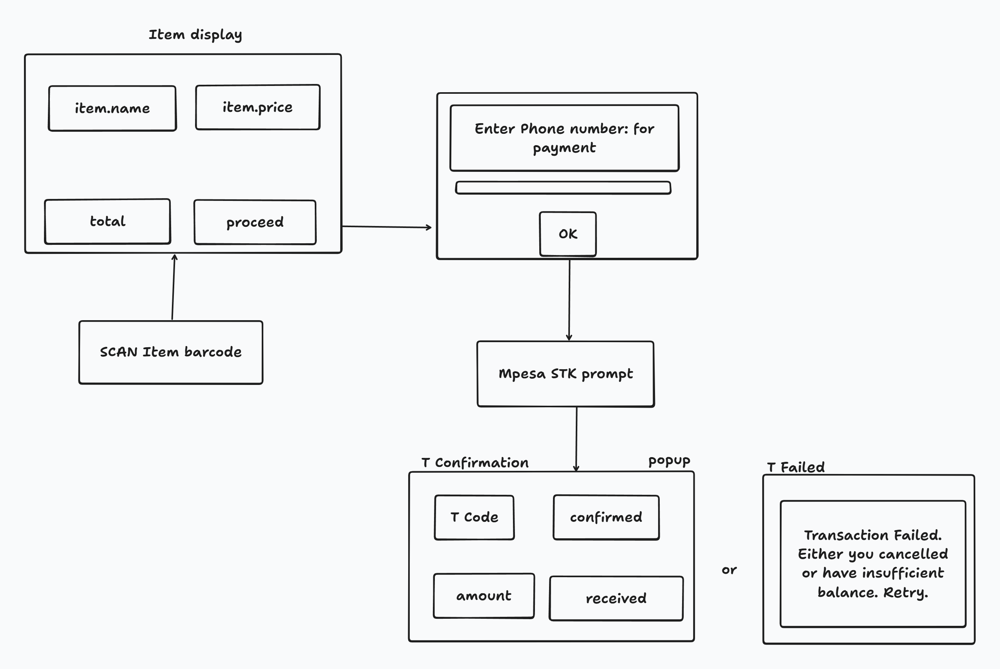

# Shop-it: Mobile Self-Checkout Documentation

## Problem Statement

When customers go to supermarkets, they have to queue at the counter to pay
for their picked items. This is currently solved by having more counters.

But how might we enable customers to shop quickly with less hassle?

## Solution Overview

Since most items have barcodes, we've designed an application where customers
pick an item, scan the QR code, view item details and price,
make an Mpesa payment, and receive a digital receipt—all without
waiting in checkout lines.

## System Features

### 1. Barcode Scanning

**Requirements:**

- Use phone camera to scan product barcode (MVP)
- Handle scan errors with clear user feedback (MVP)
- Provide intuitive scanning interface
- ~~Validate barcode format~~ (Not needed for MVP - validation happens implicitly during inventory lookup)

**Implementation:**

- Use open-source barcode reader library - [Html5-QRCode](https://github.com/mebjas/html5-qrcode)
- Implement camera permission handling
- Add fallback for failed scans (manual entry option)
- Display clear scanning instructions to users
- Error handling via inventory lookup response

### 2. Inventory Lookup

**Requirements:**

- Connect & sync with shop inventory (MVP)
- Fetch item details: name & price using the scanned barcode number (MVP)
- Handle missing or outdated inventory entries

**Implementation:**

- Create MongoDB inventory collection with proper indexing on barcode field
- Find physical items/products with visible QR codes for testing
- Use a barcode scanner app to decode barcode numbers from test items
- Create a custom API to upload item details (name, price, stock, category, barcode) to Inventory collection
- Build 5+ test inventory items
- Implement API to fetch item details by barcode
- Add proper error handling for items not found

### 3. Item Display

**Requirements:**

- Show item name and price (MVP)
- Allow buyer to confirm before proceeding to payment (MVP)
- Display clear item information using Bootstrap styling
- Provide options to cancel/clear and rescan

**Future Enhancement:**

- Support for multiple items in a basket
- Show running total of all items
- Allow removal of individual items
- Enable checkout for multiple items at once

### 4. Phone Number Entry

**Requirements:**

- Show phone number entry field (MVP)
- Validate phone number format - must follow format: 254XXXXXXXXX
- Provide clear error messages for invalid formats
- Include "Back" option to return to item display

**Implementation:**

- Use Bootstrap form components with proper validation
- Implement client-side validation before submission
- Add placeholder showing correct format (254712345678)
- Store number temporarily for transaction processing

### 5. Mpesa Payment Integration

**Requirements:**

- Send STK push request using Mpesa API to the entered phone number (MVP)
- Process payments via Safaricom Daraja API
- Handle API errors with clear user feedback
- Secure API credentials and transactions

**Implementation:**

- Set up [Mpesa Daraja API account](https://developer.safaricom.co.ke/)
- Create payment processing API endpoint
- Implement callback URL to receive payment notifications
- Deploy app on Render.com for public callback URL
- Register callback URL with Mpesa API
- Test STK push functionality with real payments
- Implement proper error handling and timeout management

### 6. Payment Status Monitoring

**Requirements:**

- Notify customers that the Mpesa prompt was sent
- Show "Waiting for payment" status (MVP)
- Update status in near real-time without page refresh
- Handle failed or canceled transactions gracefully

**Implementation:**

- Use short-interval polling (2-3 seconds) to check payment status
- Implement proper timeout handling after maximum attempts
- Display appropriate loading indicators during the wait
- Show clear success/failure messages

### 7. Payment Confirmation

**Requirements:**

- Receive and process callback from Mpesa API (MVP)
- Store successful transaction details in database
- Show success/failure status of the transaction
- Display transaction code and amount for successful payments

**Implementation:**

- Create secure callback endpoint for Mpesa notifications
- Validate callback data before processing
- Store transaction details only for successful payments
- Update UI based on transaction outcome
- Implement error handling for failed callbacks

### 8. Receipt Display

**Requirements:**

- Show digital receipt with complete transaction details (MVP)
- Include: item name, price, timestamp, transaction code, phone number
- Format receipt in a clean, professional layout
- Provide option to return to start/scan again

**Implementation:**

- Use Bootstrap card component for receipt display
- Include all transaction metadata from database
- Style receipt for readability on mobile devices
- Add options to save/share receipt in future versions

## Critical Additional Features

### 9. Session Management

**Requirements:**

- Maintain transaction state throughout the process
- Handle browser refreshes without losing context
- Implement timeouts for abandoned sessions

**Implementation:**

- Use browser localStorage for session persistence
- Implement unique session IDs for transaction tracking
- Add confirmation before discarding in-progress transactions

### 10. Security Measures

**Requirements:**

- Protect customer payment information
- Prevent transaction tampering
- Secure all API endpoints

**Implementation:**

- Never store payment credentials locally
- Implement CSRF protection on all forms
- Use HTTPS for all communications
- Add server-side validation for all inputs
- Implement rate limiting on sensitive endpoints

### 11. Analytics & Error Logging

**Requirements:**

- Track usage patterns and success rates
- Log errors for debugging
- Monitor system performance

**Implementation:**

- Add basic analytics tracking
- Implement comprehensive error logging
- Create dashboard for key metrics

## Development Environment

**For development, I'll need quick visual view of the database**  
Install `mongodb for vscode` extension and connect to mongodb.

## Development Tools & Languages

| Category     | Tools / Platforms                          |
|--------------|--------------------------------------------|
| **Platform** | Web-based                                  |
| **Deployment** | [Render](https://www.render.com)         |
| **Code Hosting** | GitHub                                 |
| **AI Assistant** | GitHub Copilot / GPT 4.1               |
| **IDE**      | VS Code                                    |
| **Database** | MongoDB                                    |
| **Languages & Frameworks** | Python, Flask, Jinja, HTML, CSS, JS, Bootstrap |
| **API**      | Mpesa Daraja, HTTPie                       |
| **Browser**  | Google Chrome                              |

## Success Criteria for MVP

1. Complete end-to-end flow from scan to receipt
2. <5% transaction failure rate
3. Average checkout time under 60 seconds
4. Support for major mobile browsers (Chrome, Safari)
5. Responsive design working on devices 320px and up

## Layout overview

